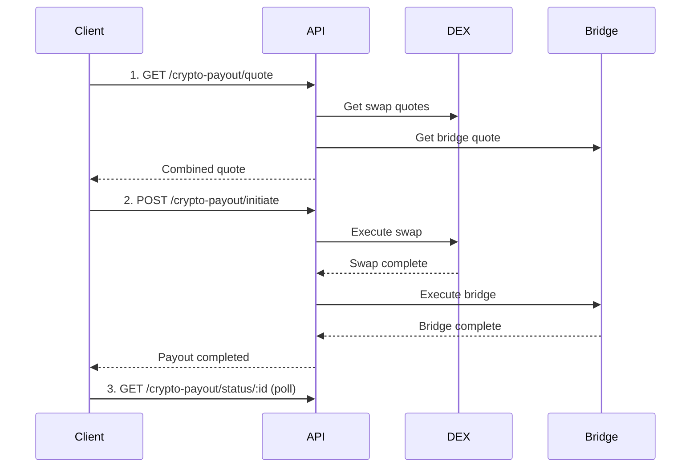

# Stablecoin-to-Stablecoin (S2S) Payout

Transfer stablecoins across chains using DEX swaps (Uniswap, CowSwap) and cross-chain bridges (Relay).

## Flow Overview



## Step 1: Get a Quote

```bash
curl -X GET "https://dev.teelapp.io/api/crypto-payout/quote?sourceToken=MYRC&destToken=USDC&sourceChain=42161&destChain=42161&amount=1000&walletAddress=0xSENDER&recipientAddress=0xRECIPIENT" \
  -H "Authorization: Bearer YOUR_TOKEN"
```

The quote includes:

- **DEX swap** rate (e.g., MYRC → USDT on Arbitrum)
- **Bridge** rate if cross-chain (e.g., Arbitrum → Base)
- **Total fees** and estimated output

## Step 2: Initiate Payout

```bash
curl -X POST "https://dev.teelapp.io/api/crypto-payout/initiate" \
  -H "Authorization: Bearer YOUR_TOKEN" \
  -H "Content-Type: application/json" \
  -d '{
    "sourceToken": "MYRC",
    "destToken": "USDC",
    "sourceChain": 42161,
    "destChain": 42161,
    "amount": "1000",
    "walletAddress": "0xSENDER",
    "recipientAddress": "0xRECIPIENT"
  }'
```

## Step 3: Poll Status

```bash
curl -X GET "https://dev.teelapp.io/api/crypto-payout/status/cp_abc123" \
  -H "Authorization: Bearer YOUR_TOKEN"
```

Status transitions: `pending` → `processing` → `completed` (or `failed`).

## Supported Chains

| Chain            | Chain ID |
| ---------------- | -------- |
| Ethereum Mainnet | 1        |
| Arbitrum One     | 42161    |
