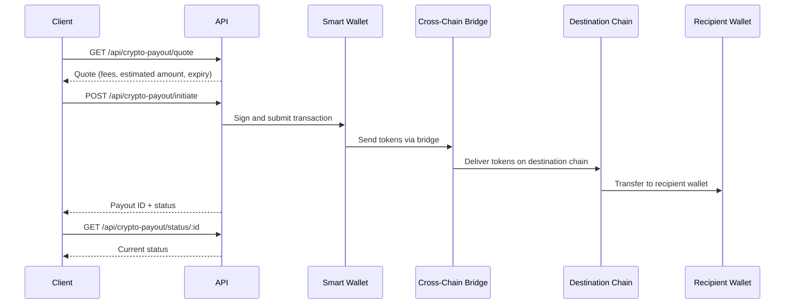

## Overview

Crypto payouts allow you to send stablecoins from one chain to another using managed smart wallets and a cross-chain bridge. This is useful for cross-chain settlement, paying recipients in their preferred stablecoin, or moving funds between networks.

<Note>
  Requires smart wallet and bridge configuration on the server. Contact your
  account manager if you have not completed bridge setup.
</Note>

## Flow



## Step 1: Get a Quote

Request a quote to see fees, estimated delivery amount, and expiry time before committing to a payout.

```bash
curl -X GET "https://dev.teelapp.io/api/crypto-payout/quote?\
sourceToken=MYRC&\
destToken=USDC&\
sourceChain=arbitrum&\
destChain=polygon&\
amount=1000&\
walletAddress=0xYourWalletAddress&\
recipientAddress=0xRecipientAddress" \
  -H "Authorization: Bearer YOUR_API_TOKEN"
```

### Query Parameters

| Parameter          | Type   | Description                                         |
| ------------------ | ------ | --------------------------------------------------- |
| `sourceToken`      | string | Token to send (e.g., `MYRC`, `USDC`)                |
| `destToken`        | string | Token the recipient receives (e.g., `USDC`)         |
| `sourceChain`      | string | Origin chain (e.g., `arbitrum`, `ethereum`)         |
| `destChain`        | string | Destination chain (e.g., `polygon`, `base`)         |
| `amount`           | number | Amount in the source token's smallest unit          |
| `walletAddress`    | string | Your smart wallet address                           |
| `recipientAddress` | string | Recipient's wallet address on the destination chain |

### Response

```json
{
  "quote": {
    "sourceAmount": "1000",
    "destAmount": "998.50",
    "fee": "1.50",
    "exchangeRate": "1.0",
    "expiresAt": "2026-03-11T12:05:00Z"
  }
}
```

## Step 2: Initiate the Payout

Once you have a quote, initiate the payout. The server will sign the transaction using your smart wallet and submit it to the cross-chain bridge.

```bash
curl -X POST "https://dev.teelapp.io/api/crypto-payout/initiate" \
  -H "Authorization: Bearer YOUR_API_TOKEN" \
  -H "Content-Type: application/json" \
  -d '{
    "sourceToken": "MYRC",
    "destToken": "USDC",
    "sourceChain": "arbitrum",
    "destChain": "polygon",
    "amount": 1000,
    "walletAddress": "0xYourWalletAddress",
    "recipientAddress": "0xRecipientAddress"
  }'
```

### Response

```json
{
  "id": "cp_abc123",
  "status": "pending",
  "sourceChain": "arbitrum",
  "destChain": "polygon",
  "amount": "1000",
  "createdAt": "2026-03-11T12:00:00Z"
}
```

## Step 3: Check Status

Poll the status endpoint to track the payout through its lifecycle.

```bash
curl -X GET "https://dev.teelapp.io/api/crypto-payout/status/cp_abc123" \
  -H "Authorization: Bearer YOUR_API_TOKEN"
```

### Response

```json
{
  "id": "cp_abc123",
  "status": "completed",
  "sourceChain": "arbitrum",
  "destChain": "polygon",
  "sourceTxHash": "0xabc...",
  "destTxHash": "0xdef...",
  "amount": "1000",
  "destAmount": "998.50",
  "completedAt": "2026-03-11T12:02:30Z"
}
```

### Status Values

| Status       | Description                                          |
| ------------ | ---------------------------------------------------- |
| `pending`    | Payout created, transaction not yet submitted        |
| `processing` | Transaction submitted, waiting for bridge completion |
| `completed`  | Tokens delivered to recipient on destination chain   |
| `failed`     | Transaction or bridge failed                         |
