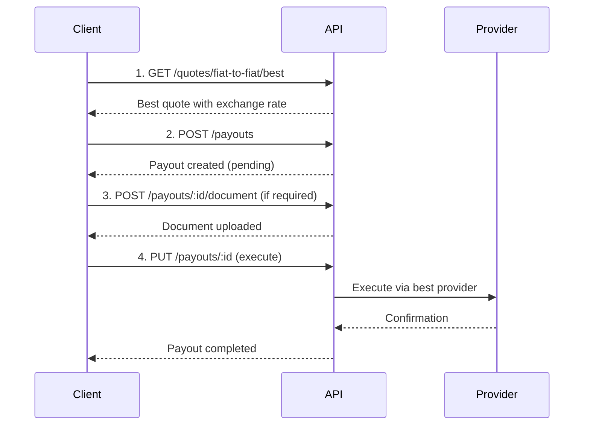

# Fiat-to-Fiat Payout

This guide walks through the complete flow for sending a cross-border fiat payment from one currency to another.

## Flow Overview



## Step 1: Get a Quote

Fetch the best available rate for your currency pair:

```bash
curl -X GET "https://dev.teelapp.io/api/quotes/fiat-to-fiat/best?source_currency=USD&target_currency=MYR&amount=1000" \
  -H "Authorization: Bearer YOUR_TOKEN"
```

```json
{
  "fromCcy": "USD",
  "toCcy": "MYR",
  "amount": "1000",
  "exchangeRate": "4.4250",
  "provider": "airwallex",
  "payoutAmount": "4425.00"
}
```

## Step 2: Create a Payout

Create the payout record with recipient and amount details:

```bash
curl -X POST "https://dev.teelapp.io/api/payouts" \
  -H "Authorization: Bearer YOUR_TOKEN" \
  -H "Content-Type: application/json" \
  -d '{
    "transaction_type": "payout",
    "payout_amount": 4425.00,
    "source_amount": 1000.00,
    "source_currency": "USD",
    "payout_currency": "MYR",
    "recipient_id": "rec_abc123",
    "payment_method": "fiat_bank_transfer",
    "payment_purpose": "trade_settlement"
  }'
```

## Step 3: Upload Supporting Document (if required)

Some corridors require supporting documentation:

```bash
curl -X POST "https://dev.teelapp.io/api/payouts/pay_xyz/document" \
  -H "Authorization: Bearer YOUR_TOKEN" \
  -F "document=@invoice.pdf"
```

## Step 4: Execute the Payout

Update the payout status to trigger execution:

```bash
curl -X PUT "https://dev.teelapp.io/api/payouts/pay_xyz" \
  -H "Authorization: Bearer YOUR_TOKEN" \
  -H "Content-Type: application/json" \
  -d '{"status": "processing"}'
```

## Checking Payout Status

Poll the payout to check completion:

```bash
curl -X GET "https://dev.teelapp.io/api/payouts/pay_xyz" \
  -H "Authorization: Bearer YOUR_TOKEN"
```

The `status` field will transition: `pending` → `processing` → `completed` (or `failed`).
