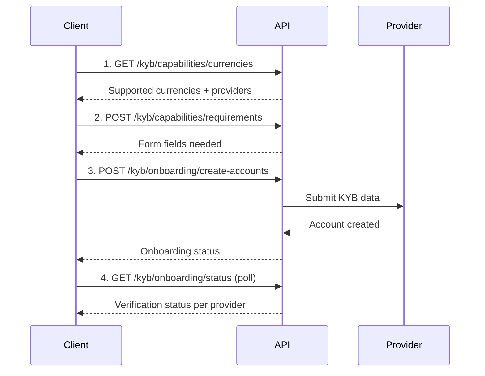

# KYB Onboarding

Before transacting, businesses must complete KYB (Know Your Business) verification with one or more payment providers.

## Flow Overview



## Step 1: Check Supported Currencies

```bash
curl -X GET "https://dev.teelapp.io/api/kyb/capabilities/currencies" \
  -H "Authorization: Bearer YOUR_TOKEN"
```

## Step 2: Get Form Requirements

```bash
curl -X POST "https://dev.teelapp.io/api/kyb/capabilities/requirements" \
  -H "Authorization: Bearer YOUR_TOKEN" \
  -H "Content-Type: application/json" \
  -d '{
    "source_currency": "USD",
    "target_currency": "MYR"
  }'
```

## Step 3: Submit KYB Data

```bash
curl -X POST "https://dev.teelapp.io/api/kyb/onboarding/create-accounts" \
  -H "Authorization: Bearer YOUR_TOKEN" \
  -H "X-User-ID: user_abc123" \
  -F "business_name=Acme Corp" \
  -F "country=US" \
  -F "registration_number=12345" \
  -F "documents=@certificate.pdf"
```

## Step 4: Check Onboarding Status

```bash
curl -X GET "https://dev.teelapp.io/api/kyb/onboarding/status" \
  -H "Authorization: Bearer YOUR_TOKEN" \
  -H "X-User-ID: user_abc123"
```

Returns status per provider (e.g., `approved`, `pending`, `rejected`).
