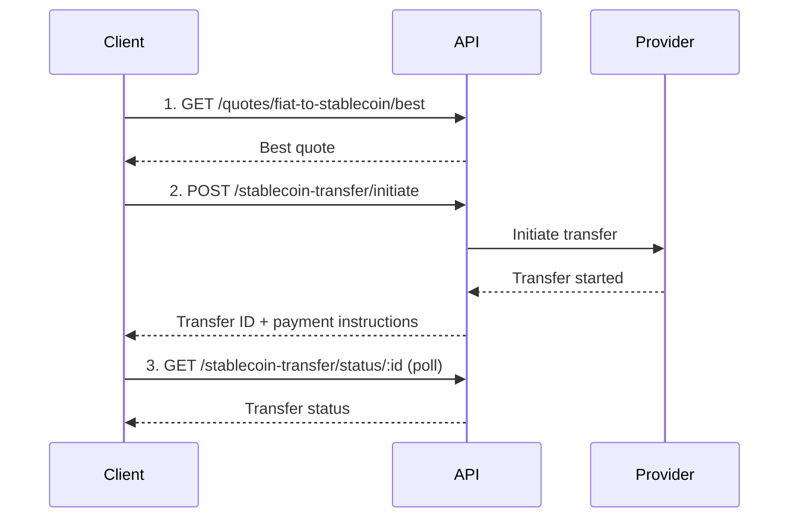

# Fiat-to-Stablecoin Transfer

Convert fiat currency into stablecoins like USDC or MYRC through integrated onramp providers.

## Flow Overview



## Step 1: Get a Quote

```bash
curl -X GET "https://dev.teelapp.io/api/quotes/fiat-to-stablecoin/best?source_currency=USD&amount=1000&crypto_ticker=USDC" \
  -H "Authorization: Bearer YOUR_TOKEN"
```

## Step 2: Initiate Transfer

```bash
curl -X POST "https://dev.teelapp.io/api/stablecoin-transfer/initiate" \
  -H "Authorization: Bearer YOUR_TOKEN" \
  -H "Content-Type: application/json" \
  -d '{
    "source_currency": "USD",
    "amount": 1000,
    "crypto_ticker": "USDC",
    "wallet_address": "0x..."
  }'
```

## Step 3: Poll Transfer Status

```bash
curl -X GET "https://dev.teelapp.io/api/stablecoin-transfer/status/txn_abc123" \
  -H "Authorization: Bearer YOUR_TOKEN"
```
