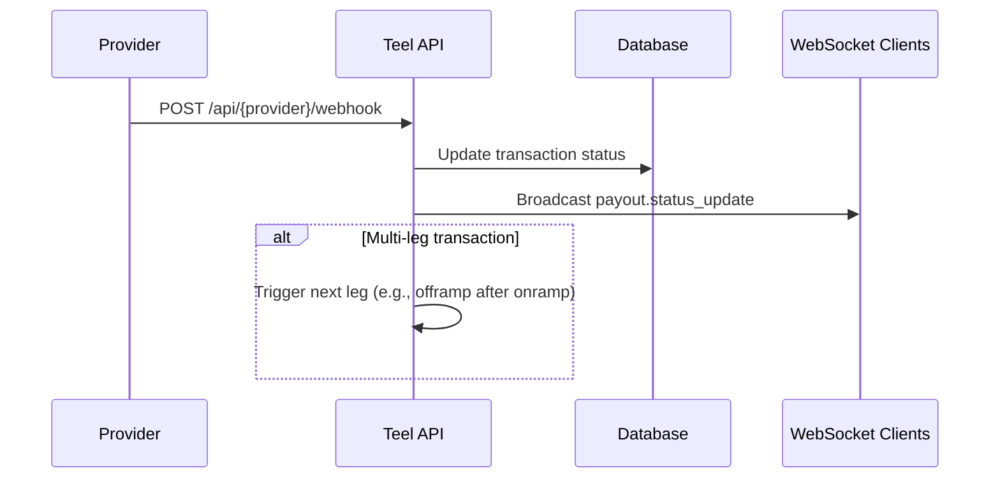
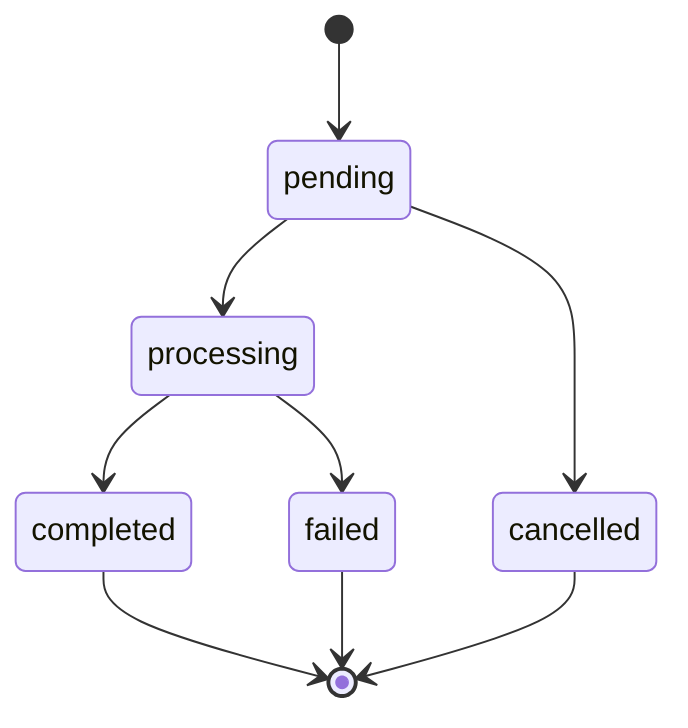

## Overview

Teel provides two mechanisms for real-time updates:

1. **WebSocket connection** -- Subscribe to events from your client or server for instant notifications.
2. **Provider webhooks** -- Automatically configured server-side hooks that Teel uses to track provider status changes and trigger multi-leg transactions.

## WebSocket Connection

Connect to the Teel WebSocket endpoint to receive real-time events for your account.

### Connecting

```javascript
const ws = new WebSocket("wss://api.teel.finance/ws", {
  headers: {
    Authorization: "Bearer YOUR_API_TOKEN"
  }
});

ws.onmessage = (event) => {
  const data = JSON.parse(event.data);
  console.log("Event:", data.type, data.payload);
};
```

### Events

| Event                  | Description                                      |
|------------------------|--------------------------------------------------|
| `payout.created`       | A new payout has been initiated                   |
| `payout.status_update` | A payout's status has changed                     |

### Payload Format

```json
{
  "type": "payout.status_update",
  "payload": {
    "id": "txn_abc123",
    "status": "completed",
    "previousStatus": "processing",
    "amount": "5000.00",
    "currency": "USD",
    "recipientId": "rec_xyz789",
    "updatedAt": "2026-03-11T14:30:00Z"
  }
}
```

#### `payout.created`

```json
{
  "type": "payout.created",
  "payload": {
    "id": "txn_def456",
    "status": "pending",
    "amount": "10000.00",
    "currency": "EUR",
    "recipientId": "rec_abc123",
    "createdAt": "2026-03-11T14:00:00Z"
  }
}
```

## Provider Webhooks

Provider webhooks are managed entirely on the server side. You do not need to configure them -- Teel sets them up automatically when your provider accounts are created.

### How They Work



Each payment provider sends webhook notifications to a provider-specific endpoint:

```
POST https://api.teel.finance/api/{provider}/webhook
```

When Teel receives a provider webhook:

1. The transaction status is updated in the database.
2. A `payout.status_update` event is broadcast to connected WebSocket clients.
3. If the transaction is part of a multi-leg flow (e.g., onramp followed by offramp), the next leg is triggered automatically.

## Status Transitions

All payouts follow a consistent set of status transitions regardless of the underlying provider.



| Status       | Description                                                    |
|--------------|----------------------------------------------------------------|
| `pending`    | Payout created but not yet submitted to the provider            |
| `processing` | Provider has accepted the payout and is executing it            |
| `completed`  | Funds have been delivered to the recipient                      |
| `failed`     | The payout failed during processing (check error details)       |
| `cancelled`  | The payout was cancelled before processing began                |

### Transition Rules

- `pending` to `processing`: The payout has been submitted to the provider.
- `pending` to `cancelled`: The payout was cancelled before submission (user-initiated or system timeout).
- `processing` to `completed`: The provider confirmed successful delivery.
- `processing` to `failed`: The provider reported a failure (insufficient funds, compliance block, network error, etc.).

## Example: Listening for Completion

```javascript
const ws = new WebSocket("wss://api.teel.finance/ws", {
  headers: { Authorization: "Bearer YOUR_API_TOKEN" }
});

ws.onmessage = (event) => {
  const { type, payload } = JSON.parse(event.data);

  if (type === "payout.status_update" && payload.status === "completed") {
    console.log(`Payout ${payload.id} completed at ${payload.updatedAt}`);
    // Update your UI or trigger downstream logic
  }

  if (type === "payout.status_update" && payload.status === "failed") {
    console.error(`Payout ${payload.id} failed`);
    // Alert your operations team
  }
};
```
